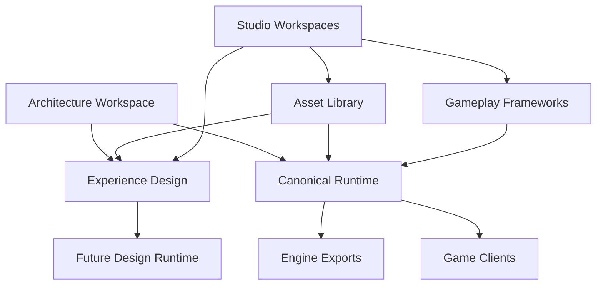

# Dependency Graph

High-level dependency direction:

```mermaid
graph TD
  Architecture["Architecture Workspace"] --> Runtime["Canonical Runtime"]
  Architecture --> Experience["Experience Design"]
  Runtime --> Exports["Engine Exports"]
  Runtime --> Game["Game Clients"]
  Experience --> FutureDesignRuntime["Future Design Runtime"]
  Assets["Asset Library"] --> Experience
  Assets --> Runtime
  Gameplay["Gameplay Frameworks"] --> Runtime
  Studio["Studio Workspaces"] --> Assets
  Studio --> Gameplay
  Studio --> Experience
```

Important boundary: Experience Design currently feeds Studio authoring and future design runtime only. It is not gameplay runtime data.

